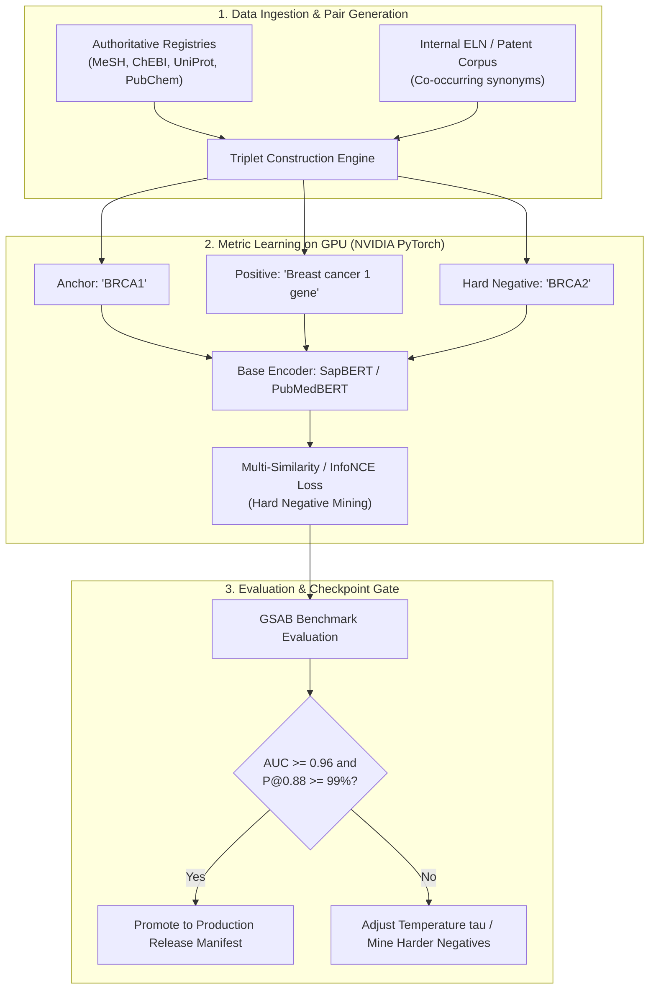

# Semantic Embedding Specification for Knowledge Graph Fusion

**Target Domains**: Biochemistry, Biophysics, Physics, Chemistry, Biology / Natural Sciences  
**Subsystem**: Layer 2 Candidate Generation & Layer 4 Confidence Decisioning  
**Author**: Hybrid KG Architecture Team  

---

## 1. Executive Definition & Role in Graph Fusion

### 1.1 What Semantic Embedding Means in Hybrid KG
In the Hybrid Knowledge Graph Platform, scientific entities arrive from heterogeneous sources (PubMed, USPTO/EPO patents, clinical trial registries, internal Electronic Lab Notebooks, and proprietary assay databases). 

Each entity node possesses textual representations:
- **Primary Labels**: e.g., `"BRCA1"`, `"p53"`, `"Acetylsalicylic acid"`, `"ATP synthase"`
- **Synonyms & Aliases**: e.g., `"Breast cancer type 1 susceptibility protein"`, `"TP53"`, `"Aspirin"`, `"ASA"`, `"Complex V"`
- **Functional Descriptions**: e.g., `"Tumor suppressor involved in DNA double-strand break repair via homologous recombination"`
- **Source Context**: Sentence fragments or claim text from the original ingested publication or patent.

A **Semantic Embedding Model** maps these textual representations into a dense vector space $\mathbb{R}^d$ (typically $d \in [768, 1024]$):
$$\mathbf{e}_u = f_\theta(\text{text}(u)) \in \mathbb{R}^d$$

### 1.2 Core Invariants of the Metric Space
1. **Semantic Equivalence (Small Angle / High Cosine Similarity)**:
   $$\text{sim}(\mathbf{e}_{\text{"BRCA1"}}, \mathbf{e}_{\text{"Breast cancer type 1 susceptibility protein"}}) \ge 0.90$$
2. **Topological Separation (Large Angle / Low Cosine Similarity)**:
   $$\text{sim}(\mathbf{e}_{\text{"BRCA1"}}, \mathbf{e}_{\text{"BRCA2"}}) \le 0.65$$
   $$\text{sim}(\mathbf{e}_{\text{"p53"}}, \mathbf{e}_{\text{"EGFR"}}) \le 0.45$$

### 1.3 Why Semantic Embeddings are Indispensable for Fusion
Exact string matching and token edit distances fail on scientific synonyms:
- `"BRCA1"` vs `"Breast cancer type 1 susceptibility gene"` shares **0% token Jaccard similarity**.
- Simple lexical heuristics cannot distinguish between **true synonyms** (which must fuse) and **sibling concepts/homonyms** (which must remain separate).
- The semantic embedding vector provides the primary statistical signal for **cross-graph identity alignment** before deterministic ontological vetoes are applied.

---

## 2. Model Selection: General-Purpose Core vs. Add-On Domains

In accordance with the Universal Implementation Philosophy, the embedding subsystem is decoupled into:
1. **Universal General-Purpose Models** (Default in Core for any general application: business, tech, enterprise, people, organizations, legal, cybersecurity).
2. **Specialized Add-On Models** (Configured via pluggable domain presets for biochemistry, chemistry, physics, etc.).

### 2.1 Universal General-Purpose Embedding Models (Core Defaults)

For general-purpose knowledge graphs (entities like Companies, Products, Persons, Locations, Events, and Abstract Concepts), we evaluate the top foundation models:

| Model Identifier | Parameter Count & Dims | Context Length | Strengths for General KG Fusion | Recommended General Role |
| :--- | :--- | :--- | :--- | :--- |
| **BGE-large-en-v1.5**<br>`BAAI/bge-large-en-v1.5` | 335M params<br>1024 dims | 512 tokens | Top-tier MTEB ranking for semantic textual similarity and clustering. Calibrated cosine space. | **Default Primary Model for General KG Core** |
| **ModernBERT-base**<br>`answerdotai/ModernBERT-base` | 149M params<br>768 dims | **8,192 tokens** | Modern 2024/2025 architecture with FlashAttention-2 and RoPE. High-speed inference and long document context. | **Fast, Long-Context General Alternative** |
| **all-mpnet-base-v2**<br>`sentence-transformers/all-mpnet-base-v2` | 110M params<br>768 dims | 384 tokens | Battle-tested industry standard sentence bi-encoder. High compatibility across standard CPU/GPU pipelines. | Lightweight General Baseline |
| **BGE-M3**<br>`BAAI/bge-m3` | 567M params<br>1024 dims | **8,192 tokens** | Native multilingual support across 100+ languages. Unifies dense, sparse lexical, and multi-vector search. | **Multilingual & Global Enterprise KGs** |
| **NV-Embed-v2**<br>`nvidia/NV-Embed-v2` | 7B params<br>4096 dims | 32k tokens | #1 overall on MTEB Leaderboard. Decoder-guided latent attention pooling. | **NVIDIA Hardware-Accelerated Cluster Scale** |

---

### 2.2 Domain-Specific Add-On Models (Pluggable Presets)

When a specific domain plugin (e.g. Biomedical, Chemistry, Materials Physics) is activated, it overrides the general embedding model with its specialized domain encoder:

| Domain | Model Identifier | Specialization & Strengths |
| :--- | :--- | :--- |
| **Biomedical & Life Sciences** | **SapBERT**<br>`cambridgeltl/SapBERT-from-PubMedBERT-fulltext` | Self-alignment on 4M+ UMLS concepts; maps biological synonyms to identical vectors. |
| **Scientific Literature / Patents** | **SPECTER 2**<br>`allenai/specter2_base` | Pre-trained on multi-disciplinary scientific citation graphs for papers and patents. |
| **Chemistry & Molecules** | **ChemBERTa-2**<br>`DeepChem/ChemBERTa-77M-MTR` | Pre-trained on 77M PubChem SMILES structures for chemical attributes and drugs. |
| **Biomedical Fine-Tuning Base**| **PubMedBERT**<br>`microsoft/BiomedicalBERT-fulltext` | Pre-trained from scratch on PubMed abstracts; base backbone for custom domain training. |

---

### 2.3 Standardization Summary

```
┌────────────────────────────────────────────────────────────────────────┐
│                   STANDARDIZED EMBEDDING ARCHITECTURE                 │
├────────────────────────────────────────────────────────────────────────┤
│ 1. GENERAL CORE (Universal Default):                                   │
│    • Entity & Text Alignment:   BGE-large-en-v1.5 (or ModernBERT)      │
│    • Multilingual Enterprise:   BGE-M3                                 │
│    • NVIDIA Enterprise Scale:   NV-Embed-v2                            │
│                                                                        │
│ 2. DOMAIN ADD-ONS (Pluggable Presets):                                 │
│    • Biomedical Entities:       SapBERT                                │
│    • Scientific Source Docs:    SPECTER 2                              │
│    • Molecular Chemistry:       ChemBERTa-2                            │
└────────────────────────────────────────────────────────────────────────┘
```

---

## 3. Benchmark Specification for "Good Enough" Embeddings

To ensure objective validation before deploying any model to production fusion, we establish the **Griffin Semantic Alignment Benchmark (GSAB)**.

### 3.1 Dataset Architecture: Positive & Negative Pairs

```
                                  EVALUATION SET (GSAB-v1)
                                             │
                   ┌─────────────────────────┴─────────────────────────┐
                   ▼                                                   ▼
         POSITIVE PAIRS (N = 2,500)                           NEGATIVE PAIRS (N = 5,000)
         True Equivalences (Label A == Label B)               Distinct Concepts (Label A != Label B)
         ──────────────────────────────────────               ──────────────────────────────────────
         • Synonym variations:                                • Hard Negatives (Sibling concepts):
           ("BRCA1", "Breast cancer type 1 susceptibility")     ("BRCA1", "BRCA2") [0.60 - 0.75 cosine]
         • Acronym vs Expansions:                             • Homonyms in different domains:
           ("p53", "Cellular tumor antigen p53")                ("Apple Inc", "Malus domestica")
         • Chemical vs Brand/Generic:                         • Different entities in same pathway:
           ("Acetylsalicylic acid", "Aspirin")                  ("p53", "MDM2"), ("EGFR", "Gefitinib")
         • Multi-word Scientific Concepts:                    • Random Unrelated Controls:
           ("DNA repair", "Deoxyribonucleic photolyase")        ("ATP synthase", "Quantum decoherence")
```

### 3.2 Quantitative Evaluation Metrics

1. **Area Under the ROC Curve (AUC-ROC)**:
   Measures overall ability to score positive pairs higher than negative pairs across all classification thresholds. **Target: $\ge 0.96$**.
2. **Separation Margin ($\Delta_{\text{sep}}$)**:
   $$\Delta_{\text{sep}} = \mu(\text{sim}_{\text{positive}}) - \mu(\text{sim}_{\text{negative}})$$
   **Target: $\Delta_{\text{sep}} \ge 0.35$**.
3. **Accuracy & F1-Score at Decision Thresholds**:
   - At Auto-Merge Threshold ($T_{\text{high}} = 0.88$): **Precision must be $\ge 99.0\%$** (zero false merges).
   - At Keep-Separate Threshold ($T_{\text{low}} = 0.65$): **False Negative Rate must be $\le 1.0\%$** (no true synonym discarded).
4. **Expected Calibration Error (ECE)**:
   $$\text{ECE} = \sum_{m=1}^M \frac{|B_m|}{N} \left| \text{acc}(B_m) - \text{conf}(B_m) \right|$$
   Ensures cosine similarity behaves as a true probability of equivalence. **Target: $\text{ECE} \le 0.05$**.

---

## 4. Embedding Training & Fine-Tuning Procedure

When base models require adaptation for proprietary internal assays, patents, or specific natural science subfields, the following fine-tuning pipeline is executed:



### 4.1 Loss Function Formulation
We employ the **InfoNCE / Multiple Negatives Ranking Loss (MNRL)** with in-batch and explicit hard negative mining:
$$\mathcal{L}_{\text{MNRL}} = - \sum_{i=1}^B \log \frac{\exp\left(\frac{\text{sim}(\mathbf{e}_{a_i}, \mathbf{e}_{p_i})}{\tau}\right)}{\exp\left(\frac{\text{sim}(\mathbf{e}_{a_i}, \mathbf{e}_{p_i})}{\tau}\right) + \sum_{j \ne i}^B \exp\left(\frac{\text{sim}(\mathbf{e}_{a_i}, \mathbf{e}_{p_j})}{\tau}\right) + \sum_{k=1}^K \exp\left(\frac{\text{sim}(\mathbf{e}_{a_i}, \mathbf{e}_{n_{i,k}})}{\tau}\right)}$$
- Temperature $\tau = 0.05$ creates sharp decision boundaries.
- Explicit hard negative set $\{n_{i,k}\}$ prevents confusion between sibling genes, chemical isomers, and distinct proteins in the same family.

### 4.2 Training Infrastructure Requirements
- **Framework**: PyTorch + Hugging Face `sentence-transformers` / NVIDIA NeMo.
- **Hardware**: 1–2x NVIDIA A100/H100 (or RTX 4090 for local pilot runs).
- **Batch Size**: Large batch size ($B \ge 128$) with FP16/BF16 mixed precision to maximize negative contrast within batches.

---

## 5. End-to-End Integration into Graph Fusion Engine

The semantic embedding model integrates into the existing 6-stage pipeline without modifying Core domain-neutral mechanics:

```
[ GRAPH A ] ────────────────────────────────────────┐
                                                    ▼
                                           STAGE 2: CANDIDATE FINDER
                                           1. Exact ID match (keys)
                                           2. Label token overlap
[ GRAPH B ] ──────────────────────────────> 3. SEMANTIC EMBEDDING COSINE
                                                    │
                                                    ▼ (Composite Score S)
                                           STAGE 3: MEANING ALIGNER
                                           (Disjoint Class Veto)
                                                    │
                                                    ▼
                                           STAGE 4: CONFIDENCE DECIDER
                                           • S >= 0.88  -> AUTO_MERGE (Stage 5)
                                           • 0.65-0.88  -> REVIEW_REQUIRED (Audit Queue)
                                           • S < 0.65   -> KEEP_SEPARATE (Coexist)
```

### Future Modality Extensions (Deferred Roadmap)
When Structural (GNN) and Attribute (Molecular/Physical) embeddings are introduced:
$$S_{\text{final}} = w_{\text{semantic}} \cdot S_{\text{semantic}} + w_{\text{attribute}} \cdot S_{\text{attribute}} + w_{\text{structural}} \cdot S_{\text{structural}}$$
The Stage 4 confidence thresholds and disjoint ontological invariants remain **100% invariant**.
